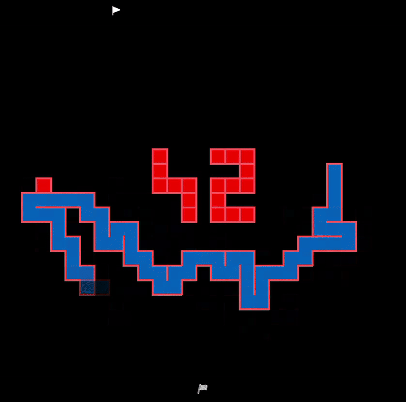
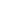

*This project has been created as part of the 42 curriculum by dgajowni, skolsut*

# A-Maze-ing

## Description

This project is an advanced maze generator and visualizer that focuses on real-time rendering, animation, and user interaction.
It allows users not only to generate and display mazes, but also to observe and control the entire generation and solving processes through smooth animations and customizable visuals.

The application supports real-time maze rendering as well as a separate animation showing how the maze is built step by step.
It also includes shortest-path visualization, along with an animated process of finding that path, making the underlying algorithms easy to understand and visually engaging.

A key feature of the project is its high level of visual customization.
Users can smoothly adjust the maze size, color palette, wall thickness, fading effects, and overall visual theme during runtime.
All changes are applied fluidly without restarting the application.

The maze generation animation can be paused, resumed, or restarted at any time.
Additionally, a dedicated slider allows precise control over the animation speed, enabling the user to slow down or accelerate the maze generation process in real time.

In addition to visualization, the project includes a game mode, allowing the user to navigate through the maze manually and complete it against the clock.

As an advanced visual feature, the interior of the maze walls uses a dynamically generated, modifiable rough brick texture.
This texture is created in real time and can be customized by independently adjusting the vertical and horizontal mortar thickness, as well as the number of bricks in both directions.
Changing these parameters directly affects the brick size and overall appearance of the maze walls.

Overall, the project combines algorithmic maze generation with interactive gameplay and advanced visual effects, emphasizing both technical correctness and aesthetic flexibility.

## Showcase

### Maze generation 

### Path finding 


## Instructions


### Installation
```bash
make install
make run
```

### Controls

#### Maze generation

| Action                                 | Control                    |
| -------------------------------------- | -------------------------- |
| Generate new maze                      | `N`                        |
| Increase/decrease maze size            | `Arrows`                   |
| Restart current maze                   |  |
| Display/animation mode                 |  |
| Pause/Resume maze generation animation |  /  |
| Freeze/Resume painting                  |  |
| Adjust maze generation speed           | `Speed slider`             |
| Toggle shortest path display/animation |  |
| Enter/Exit game mode                   |  / `G` |

#### Game mode

| Action             | Control       |
| ------------------ | ------------- |
| Move               | `Arrows`      |
| Undo last move     | `Backspace`   |

#### Visual effects

| Action                      | Control                   |
| --------------------------- | ------------------------- |
| Change wall thickness       | `+/-` (numpad)            |
| Toggle/adjust fading effect | `W/S`                     |
| Change overall theme        | `A/D`                     |
| Save theme                  |  |

#### Bricks adjustment

| Action                                           | Control         |
| -------------------------------------------------| --------------- |
| Brick visible                                    | `B`             |
| Increase/decrease horizontal mortar thickness    | `8/2` (numpad)  |
| Increase/decrease vertical mortar thickness      | `6/4` (numpad)  |
| Increase/decrease amount of bricks horizontally  | `J/L`           |
| Increase/decrease amount of bricks vertically    | `K/I`           |


## Configuration

The application uses a `config.txt` file for initial setup. The file follows a simple `KEY=VALUE` format:

```ini
WIDTH=30             # Width of the maze (integer)
HEIGHT=30            # Height of the maze (integer)
ENTRY=1,1            # Start coordinates (x,y)
EXIT=29,29           # End coordinates (x,y)
OUTPUT_FILE=maze.txt # Filename to save the generated maze
PERFECT=True         # True for a perfect maze, False for loops
HEART=False          # Experimental heart-shaped maze (Optional)
SEED=123456          # Optional seed for reproducibility
```

## Technical Overview

### Maze Generation Algorithm: Wilson's Algorithm
For this project, we implemented **Wilson's Algorithm**. 

**Why Wilson's Algorithm?**
- **Unbiased Distribution:** Unlike Randomized Prim's or Kruskal's, Wilson's algorithm generates a "Uniform Spanning Tree," meaning all possible perfect mazes of a given size are equally likely to be generated.
- **Loop-Erased Random Walks:** The algorithm uses loop-erased random walks, which creates a very distinct and mathematically interesting generation process that is visually engaging when animated.
- **Complexity:** It presents a higher technical challenge to implement efficiently compared to simpler depth-first searches, fitting the "advanced" nature of the project.

### Reusability
The project is designed with modularity in mind:
- **`mazegen` Package:** The entire core logic (generation and solving) is decoupled from the visualization. It exists as a standalone, installable Python package that can be integrated into any other Python project.
- **Rendering Engine:** The visualization logic in `utils` and `objects` can be adapted for other grid-based simulations or games using the MLX library.
- **Directional Logic:** The `Direction` and `Key` enums provide a clean abstraction for handling 2D movement and input that can be reused in similar projects.

## Project Management

### Team Roles
- **Dawid Gajownik (dgajowni):** Lead Architect for the visualization engine, real-time rendering logic, and UI/UX implementation.
- **Sebastian Kolsut (skolsut):** Core Developer for the `mazegen` library, algorithm implementation (Wilson's), and documentation.

### Planning and Evolution
The project was planned in three phases:
1. **Foundation:** Designing the data structures for the maze and implementing the core generation algorithm.
2. **Interactive Visualization:** Implementing the real-time rendering engine and the interactive UI elements.
3. **Refinement:** Adding advanced features like the "42" sign pattern, heart shape, and the dynamic brick texture system.

The planning evolved as we realized the potential for better visual feedback, leading us to invest more time in the "animation speed" and "fading effect" features than initially anticipated.

### Development Challenges
Throughout the development process, we encountered and overcame several key obstacles:
- **Integration and Cooperation:** Initially, we faced difficulties in synchronizing our distinct parts of the project. However, by establishing a clearer modular architecture and improving our collaborative workflow, we were able to seamlessly integrate the core generation logic with the visualization engine.
- **Performance Optimization:** Execution speed was a significant concern in the early stages. Both the maze generation algorithm and the real-time rendering system required extensive refinement. Through iterative adjustments and optimizations, we significantly improved the application's performance, ensuring a smooth experience even during high-speed generations and complex visual updates.

### What Could Be Improved
- Further optimization of the rendering pipeline for extremely large mazes.
- Extending the solver to support multiple pathfinding algorithms for comparison.

### Tools Used
- **Python 3:** Primary programming language.
- **MLX:** For real-time graphics rendering.
- **Flake8/MyPy:** For linting and static type checking to maintain code quality.
- **Git:** For version control and collaborative development.
- **AI Tools:** Used for rapid prototyping of boilerplate code and technical clarifications (see section below).

## Resources

- [The Ultimate, Unbiased Maze Generation Technique You Need to See](https://medium.com/@batbat.senturk/the-ultimate-unbiased-maze-generation-technique-you-need-to-see-46123d5fec76) — The primary algorithm used for maze generation in this project.

## Use of Artificial Intelligence

In the development of this project, Artificial Intelligence was utilized as a supportive tool to optimize the development lifecycle. AI assisted the authors in several key areas:

- **Development Velocity:** Accelerating the implementation of boilerplate code and repetitive structures, allowing for a primary focus on core algorithmic logic and real-time rendering performance.
- **Technical Research:** Facilitating efficient problem-solving by providing rapid clarifications on complex library interactions and language-specific nuances.
- **Refinement and Documentation:** Assisting in the structuring of documentation and performing iterative code refactoring to ensure high standards of readability and maintainability.

The use of AI in this context was strictly exploratory and assistive, serving to augment human creativity and technical decision-making throughout the project.

## mazegen Package Documentation

The `mazegen` package is a standalone module designed for generating and solving mazes. It provides a flexible API for creating randomized mazes with customizable parameters and finding solutions.

### Installation

To install the package, you can use the provided wheel file or the source distribution:

```bash
# Install using wheel
pip install mazegen-1.0.0-py3-none-any.whl

# Or install using source distribution
pip install mazegen-1.0.0.tar.gz
```

### Usage

Here is a comprehensive example of how to use the `mazegen` package to generate a maze and find a path through it.

```python
from mazegen import MazeGenerator, PathFinder, Maze

# 1. Instantiate the Maze object
# Define dimensions (width, height)
width = 15
height = 15
# Define Start (0,0) and End (14,14) coordinates
entry_coord = (0, 0)
exit_coord = (14, 14)
# Configuration flags
is_perfect = True  # True for a perfect maze (no loops)
heart_shape = False # True for heart shaped maze

maze = Maze(width, height, entry_coord, exit_coord, is_perfect, heart_shape)

# 2. Generate the Maze
# Initialize the generator
generator = MazeGenerator()
seed = 123456  # Optional seed for reproducibility

# This populates the maze.map with the generated structure
generator.create_maze_instant(maze, seed)

# 3. Access the Structure
# The maze structure is stored in maze.map as a flat list
# Each integer represents a cell and its wall configuration
print(f"Maze Map: {maze.map}")

# 4. Get String Representation
# You can also get a hex string representation of the maze
maze_str = generator.get_maze_str()
print(f"Maze String: \n{maze_str}")

# 5. Solve the Maze
# Initialize the pathfinder
finder = PathFinder()

# Find the shortest path (returns a list of cell indices)
solution_path = finder.find_path_instant(maze)
print(f"Solution Path: {solution_path}")

# 6. Get Path as Directions
# Convert the solution path to a string of directions (N, S, E, W)
path_str = finder.get_str_path(solution_path)
print(f"Path String: {path_str}")
```

### Parameters

The `MazeGenerator` and `Maze` classes support the following custom parameters:

-   **width** (`int`): The width of the maze grid.
-   **height** (`int`): The height of the maze grid.
-   **entry** (`Tuple[int, int]`): The starting coordinates (x, y) of the maze.
-   **exit** (`Tuple[int, int]`): The ending coordinates (x, y) of the maze.
-   **is_perfect** (`bool`): If `True`, generates a perfect maze where exactly one path exists between any two points. If `False`, the maze may contain loops.
-   **heart** (`bool`): If `True`, creates a heart-shaped pattern within the maze (experimental feature).
-   **seed** (`int`): An integer seed passed to the generator to ensure deterministic and reproducible maze generation.

### Structure Access

-   **Maze Structure**: Use `maze.map` to access the generated grid. It is a one-dimensional list of integers where each index corresponds to `y * width + x`. The integer value encodes the state of the cell (walls, visited status, etc.).
-   **Solution**: The `find_path_instant` method returns a list of integers, where each integer represents the index of a cell in the path from the entry to the exit.

### API Reference

#### `class Maze`
The data structure representing the maze.

*   `__init__(width: int, height: int, entry: Tuple[int, int], exit: Tuple[int, int], is_perfect: bool, heart: bool = False)`
    *   Initializes the maze grid.
*   `set_width(new_width: int)` / `set_height(new_height: int)`
    *   Updates dimensions and resets entry/exit points.

#### `class MazeGenerator`
The algorithmic core for generating maze structures.

*   `create_maze_instant(maze: Maze, seed: Optional[int] = None) -> str`
    *   Generates a maze instantly using the given seed (optional) and populates the `maze` object. Returns the maze structure as a string.
*   `create_maze(maze: Maze, seed: Optional[int] = None, visualize: bool = False) -> Generator`
    *   A generator version of the creation process. Yields intermediate states `(found_cells, current_path)` for visualization purposes.
*   `get_maze_str() -> str`
    *   Returns the hex string representation of the generated maze.

#### `class PathFinder`
The solver engine.

*   `find_path_instant(maze: Maze) -> List[int]`
    *   Solves the maze instantly (BFS) and returns the solution path as a list of cell indices.
*   `find_path(maze: Maze) -> Generator`
    *   A generator version of the solver. Yields visited cells during search and eventually yields the solution path.
*   `get_str_path(path: List[int]) -> str`
    *   Converts a list of path cell indices into a string of cardinal directions ('N', 'S', 'E', 'W').
